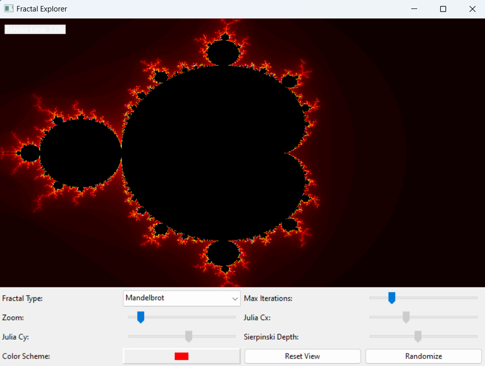

[//]: # (to visualize md files, i.e., MarkDown files, you can use VS-code and CTRL-SHIFT-V)
[//]: # (or preview it online at https://markdownlivepreview.com/)
<!--- a comment -->

# Fractaly - Fractal Visualization Tool


A cross-platform application for generating and exploring fractal images.

## Features
- Multiple fractal types (Mandelbrot, Julia, etc.)
- Interactive zoom/pan
- Custom color schemes

## Install from PyPI
You can directly install fractaly from PyPI 
https://pypi.org/project/fractaly/
```bash
pip install fractaly     #install fractaly
pip uninstall fractaly   #uninstall fractaly
```

## Install the full source code from github
```bash
git clone https://github.com/masoud-najafi/fractaly.git
cd fractaly
#instal in development mode 
pip install -e . 
#or install in production mode
pip install  .  
```

## installation test
```bash
python -c "import fractaly"
```

##  create *.whl *.gz packages and upload to PyPI

```bash
#this command uses pyproject.toml file to build the packages.
#if you do not have 'build', install it: 'pip install build'
python -m build  

#to publish the new package on PyPI
#note that you have to install twine before: 'pip install twine'
python -m twine upload --verbose dist/* 
```
## create a new realse on github
```bash
git tag -a v1.0.0 -m "Initial release v1.0.0"
git push origin --tags
```

## to create a windows a build and a windows executable
```bash
python setup_cx_freeze.py build  # creates a build folder with all executable and necessary DLLs and python files.
python setup_cx_freeze.py bdist_msi  #builds and create a *.msi file
```

# upload a new relase using GithubCLI (Github Command Line Interface)

## To upload files smaller than 100MB

``` bash  
winget install --id GitHub.cli  # install (gh) Github CLI and restrat the shell
gh auth login  # give your Gitub token
gh release create v1.0.0 path/to/your/file1.exe --title "v1.0.0" --notes "First Windows build"
gh release upload v1.0.0 path/to/your/file2.exe --repo masoud-najafi/fractaly  # To add another file to an existing release
```


## Usage in Python
```python
import wx
import fractaly
app = wx.App(False)
frame = fractaly.FractalFrame()
frame.Show()
app.MainLoop()
```


## usage using Python entry point
```bash
python -m fractaly
```

## Git structure
```
fractaly/
├── .github/                # GitHub-specific files
│   └── workflows/
│       └── tests.yml
├── .gitignore
├── LICENSE.txt
├── README.md
├── pyproject.toml          # Build system config
├── setup.py         
├── setup_cx_Freeze.py          
├── requirements.txt  # Dev dependencies and # product Runtime dependencies
│
├── src/                    # Application source
│   └── fractaly/
│       ├── py.typed
│       ├── __init__.py
│       ├── __main__.py     # entry point
│       ├── algorithms/     # Fractal implementations
│       │   ├── __init__.py
│       │   └── core1.py
│       ├── core/     
│       │   ├── fractal_maths.c
│       │   └── test_fractal_maths.py
│       ├── gui/  
│       │   ├── __init__.py
│       │   └── core2.py
│       ├── icons/ 
│       │   │
│       │   └── mandel.png
│       └── lib/       # Platform-specific libraries
│           ├── win64/
│           │   └── fractal_maths.dll
│           └── linux64/
│               └── libfractal_maths.so
│
└── doc/                   # Documentation
    └── images/
    │   ├── index.md
    │   └── mandelbrot.png
    ├── licenses.md
    ├── CONTRIBUTING.md
    └── API_REFERENCE.md
    ├── tutorial.md
    └── api/
        └── reference.md

```


## sample images
# Mandelbrot


# Julia


# Sierpinski


## Build/installation hints

Key Techniques Used<br>
Underscore prefix:<br>
1)```_internal``` directory name indicates it's private<br>
2)```_PrivateClass``` name indicates it's internal<br>
<br>
Controlled exports:<br>
1) ```__all_```_ in root ```__init__.py``` specifies what gets imported with ```from package import *```<br>
2) Only explicitly import the public class in root ```__init__.py```<br>
<br>
Python module system:<br>
1) The package structure naturally hides implementation details<br>
2) Internal imports use relative imports (.internal)<br>
<br>

Version synchronization: Keep ```__version__```, ```setup.py``` version, and pyproject.toml version in sync.<br>
<br>
Type checking: The empty ```py.typed``` file indicates to type checkers (like mypy) that your package has type information.<br>
<br>
Modern vs traditional:<br>
pyproject.toml is the modern standard (PEP 621)<br>
setup.py is still widely used and may be needed for some cases<br>
<br>
Installation:<br>
For development:``` pip install -e .```<br>
For production: ```pip install .```<br>
<br>
Publishing:<br>
Build: ```python -m build```<br>
Upload to PyPI: ```twine upload dist/*```<br>


# publish using release.yml
#https://medium.com/@blackary/publishing-a-python-package-from-github-to-pypi-in-2024-a6fb8635d45d
https://pypi.org/manage/account/publishing/
